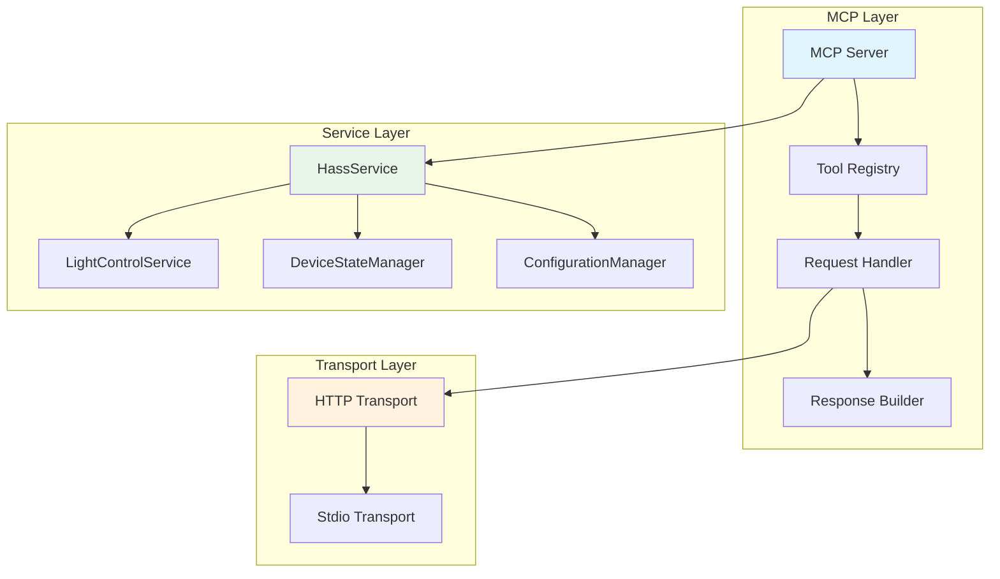

import { Callout, Tabs, Steps } from 'nextra/components'

# 开发指南

欢迎参与 Home-MCP 的开发！本指南将帮助你了解项目架构、开发环境搭建以及如何贡献代码。

## 🏗️ 项目架构

Home-MCP 采用模块化设计，清晰的架构便于理解和扩展。



### 核心组件说明

| 组件 | 职责 | 关键文件 |
|------|------|----------|
| **MCP Server** | 处理 MCP 协议通信 | `src/server/` |
| **HassService** | Home Assistant API 封装 | `src/services/hass.ts` |
| **LightControlService** | 语义化灯光控制 | `src/services/light-control.ts` |
| **Tools Registry** | 工具注册和管理 | `src/tools/` |
| **Configuration** | 配置管理 | `src/config/` |

## 🛠️ 开发环境搭建

<Steps>
## 克隆项目
```bash
git clone https://github.com/shenjingnan/home-mcp.git
cd home-mcp
```

## 安装依赖
```bash
# 使用 pnpm 安装依赖（推荐）
pnpm install

# 或使用 npm
npm install
```

## 配置开发环境
```bash
# 复制环境变量模板
cp .env.example .env

# 编辑环境变量
nano .env
```

## 启动开发服务器
```bash
# 开发模式（支持热重载）
pnpm dev

# 或者运行测试
pnpm test
```
</Steps>

### 开发环境配置

<Callout type="info" emoji="⚙️">
  **本地 Home Assistant**: 建议在本地搭建 Home Assistant 开发环境，可以手动创建一个新的令牌。
</Callout>

```bash
# .env 开发环境配置示例
HA_TOKEN="eyJ0eXAiOiJKV1QiLCJhbGciOiJIUzI1NiJ9..."
HA_BASE_URL="http://localhost:8123"
LOG_LEVEL="debug"
```

## 🔧 代码规范

项目使用 [Biome](https://biomejs.dev/) 进行代码格式化和检查：

```bash
# 代码检查
pnpm lint

# 自动修复
pnpm lint:fix

# 代码格式化
pnpm format

# 类型检查
pnpm type-check
```

### TypeScript 配置

项目使用严格的 TypeScript 配置：

```json
{
  "compilerOptions": {
    "strict": true,
    "noImplicitAny": true,
    "noUnusedLocals": true,
    "noUnusedParameters": true
  }
}
```

<Callout type="warning" emoji="⚠️">
  **类型安全**: 项目禁止使用 `any` 类型，请使用明确的类型定义或 `unknown`。
</Callout>

## 🧪 测试指南

### 测试框架

项目使用 [Vitest](https://vitest.dev/) 作为测试框架：

```bash
# 运行所有测试
pnpm test

# 监听模式
pnpm test:watch

# 生成覆盖率报告
pnpm test:coverage

# 测试特定文件
pnpm test src/services/hass.test.ts
```

### 测试结构

```
src/
├── services/
│   ├── hass.ts
│   └── hass.test.ts
├── tools/
│   ├── light-control.ts
│   └── light-control.test.ts
└── test/
    ├── fixtures/
    ├── mocks/
    └── utils/
```

### 测试最佳实践

```typescript
// 测试示例
import { describe, it, expect, beforeEach } from 'vitest';
import { HassService } from '@/services/hass.js';
import { createMockTransport } from '@/test/utils/transport.js';

describe('HassService', () => {
  let hassService: HassService;
  let mockTransport: any;

  beforeEach(() => {
    mockTransport = createMockTransport();
    hassService = new HassService(mockTransport);
  });

  it('should get device states correctly', async () => {
    const mockResponse = [
      { entity_id: 'light.living_room', state: 'on' }
    ];

    mockTransport.request.mockResolvedValue(mockResponse);

    const result = await hassService.getStates();

    expect(result).toEqual(mockResponse);
    expect(mockTransport.request).toHaveBeenCalledWith({
      method: 'get_states'
    });
  });
});
```

## 📦 构建和发布

### 构建流程

```bash
# 构建生产版本
pnpm build

# 构建输出检查
ls -la dist/

# 本地测试构建版本
node dist/index.js
```

### 发布流程

<Steps>
## 版本更新
```bash
# 更新版本号
npm version patch  # 或 minor, major

# 生成 CHANGELOG
pnpm changelog
```

## 构建和测试
```bash
# 确保所有测试通过
pnpm test

# 构建项目
pnpm build

# 运行集成测试
pnpm test:integration
```

## 发布到 npm
```bash
# 登录 npm（如果未登录）
npm login

# 发布包
npm publish

# 发布带标签的版本
npm publish --tag beta
```
</Steps>

## 🤝 贡献指南

我们欢迎所有形式的贡献！包括但不限于：

- 🐛 Bug 修复
- ✨ 新功能开发
- 📝 文档改进
- 🧪 测试用例增加
- 🔧 性能优化

### 提交流程

<Steps>
## Fork 项目
1. 访问 [GitHub](https://github.com/shenjingnan/home-mcp)
2. 点击 "Fork" 按钮
3. 克隆你的 Fork

## 创建功能分支
```bash
git checkout -b feature/amazing-feature
```

## 开发和测试
```bash
# 编写代码
pnpm dev

# 运行测试
pnpm test

# 代码格式化
pnpm lint:fix
```

## 提交更改
```bash
git add .
git commit -m "feat: 添加 amazing feature"
```

## 推送和创建 PR
```bash
git push origin feature/amazing-feature
```

然后在 GitHub 上创建 Pull Request。
</Steps>

### 提交信息规范

使用 [Conventional Commits](https://www.conventionalcommits.org/) 规范：

```
feat: 添加新功能
fix: 修复 bug
docs: 更新文档
style: 代码格式调整
refactor: 代码重构
test: 添加测试
chore: 构建工具或依赖更新
```

## 🚀 自定义工具开发

### 创建新工具

<Steps>
## 创建工具文件
在 `src/tools/` 目录下创建新工具：

```typescript
// src/tools/custom-device.ts
import { z } from 'zod';
import { HassService } from '@/services/hass.js';

const schema = z.object({
  deviceId: z.string(),
  action: z.enum(['turn_on', 'turn_off']),
  parameters: z.record(z.any()).optional()
});

export const customDeviceTool = {
  name: 'custom_device_control',
  description: '自定义设备控制工具',
  inputSchema: schema,

  async handler(args: z.infer<typeof schema>, hassService: HassService) {
    try {
      const result = await hassService.callService(
        'switch', // domain
        args.action, // service
        { entity_id: args.deviceId, ...args.parameters }
      );

      return {
        success: true,
        result
      };
    } catch (error) {
      return {
        success: false,
        error: error.message
      };
    }
  }
};
```

## 注册工具
在 `src/index.ts` 中注册新工具：

```typescript
import { customDeviceTool } from '@/tools/custom-device.js';

// 在工具列表中添加
const tools = [
  // ... 现有工具
  customDeviceTool
];
```

## 添加测试
```typescript
// src/tools/custom-device.test.ts
import { describe, it, expect } from 'vitest';
import { customDeviceTool } from '@/tools/custom-device.js';
import { createMockHassService } from '@/test/utils/hass.js';

describe('customDeviceTool', () => {
  it('should control device correctly', async () => {
    const mockHass = createMockHassService();

    const result = await customDeviceTool.handler(
      {
        deviceId: 'switch.test_device',
        action: 'turn_on'
      },
      mockHass
    );

    expect(result.success).toBe(true);
  });
});
```
</Steps>

### 工具开发最佳实践

1. **类型安全**: 使用 Zod 进行输入验证
2. **错误处理**: 提供清晰的错误信息
3. **测试覆盖**: 为每个工具编写完整的测试
4. **文档更新**: 更新相关文档和示例

## 🔍 调试和故障排除

### 开发调试

```bash
# 启用调试日志
LOG_LEVEL=debug pnpm dev

# 使用 VS Code 调试
# 在 .vscode/launch.json 中添加配置
```

VS Code 调试配置示例：

```json
{
  "version": "0.2.0",
  "configurations": [
    {
      "name": "Debug Home-MCP",
      "type": "node",
      "request": "launch",
      "program": "${workspaceFolder}/src/index.ts",
      "env": {
        "LOG_LEVEL": "debug"
      },
      "runtimeArgs": ["-r", "ts-node/register"],
      "skipFiles": ["<node_internals>/**"]
    }
  ]
}
```

### 性能分析

```bash
# 性能分析
pnpm build --analyze

# 内存使用分析
node --inspect dist/index.js
```

<Callout type="success" emoji="🎉">
  **开始贡献**: 现在你已经了解了 Home-MCP 的开发流程，欢迎为项目做出贡献！
</Callout>
