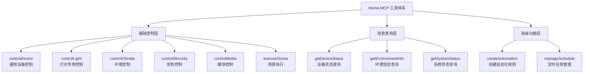

# Home-MCP 工具设计分析报告

## 1. 现状分析

### 1.1 当前项目概况

Home-MCP 是一个基于 Model Context Protocol (MCP) 的智能家居集成服务器，旨在为 AI 助手提供标准化的 Home Assistant 设备控制接口。

**核心理念**: MCP工具的设计目标是服务于LLM的理解和使用，而不是直接面向人类用户。实际使用流程为：
```
用户自然语言请求 → LLM理解意图 → 选择合适MCP工具 → 执行操作 → 返回结果给用户
```

### 1.2 当前架构分析

#### 核心技术栈
- **MCP 服务器框架**: 使用 `@modelcontextprotocol/sdk` 和 `bestmcp` 框架
- **类型安全**: 完整的 TypeScript 类型定义
- **API 通信**: 基于 Home Assistant REST API
- **参数验证**: 使用 Zod 进行参数验证

#### 当前工具实现
项目目前已实现 15 个核心工具，覆盖了 Home Assistant API 的主要功能：

1. **系统管理工具**
   - `checkHassAPIService`: 检查 API 服务状态
   - `getConfig`: 获取系统配置
   - `getComponents`: 获取组件列表
   - `checkConfig`: 检查配置文件

2. **状态查询工具**
   - `getStates`: 获取实体状态
   - `getHistory`: 获取历史数据
   - `getLogbook`: 获取日志记录
   - `getErrorLog`: 获取错误日志

3. **设备控制工具**
   - `callServices`: 调用服务（核心设备控制）
   - `updateState`: 更新状态
   - `deleteStates`: 删除实体

4. **信息获取工具**
   - `getServices`: 获取服务列表
   - `getEvents`: 获取事件列表
   - `getCameraProxy`: 获取摄像头图像
   - `getCalendars`: 获取日历信息
   - `fireEvents`: 触发事件

### 1.3 当前架构优势

- **完整性**: 覆盖了 Home Assistant API 的核心功能
- **类型安全**: 完整的 TypeScript 类型定义
- **模块化**: 基于 `bestmcp` 框架的工具装饰器模式
- **扩展性**: 易于添加新的工具和服务

### 1.4 当前架构不足

- **工具分类不够清晰**: 所有工具都在同一个服务类中，LLM难以快速定位合适的工具
- **缺乏意图导向设计**: 直接暴露底层API，缺乏基于用户意图的语义化工具设计
- **参数设计不符合LLM使用习惯**: 部分工具参数过于技术化，缺乏语义完整性
- **工具粒度不合理**: 某些工具过于细碎，某些工具过于庞大，不便于LLM理解和使用

## 2. 智能家居控制核心需求分析

### 2.1 基础设备控制需求

#### 照明系统
- 开关控制：开灯、关灯、切换状态
- 亮度调节：设置亮度百分比、亮度增减
- 色温控制：冷暖色温调节
- 颜色控制：RGB 颜色设置、场景切换

#### 环境控制
- 温度控制：空调温度设置、模式切换
- 湿度控制：加湿器、除湿器控制
- 空气质量：新风系统、空气净化器控制
- 窗帘控制：开关、百分比控制

#### 安防系统
- 门锁控制：开锁、上锁、状态查询
- 监控系统：摄像头图像获取、录像控制
- 报警系统：布防、撤防、模式切换
- 传感器监控：门窗传感器、运动传感器

#### 音视频设备
- 音响系统：播放控制、音量调节、源切换
- 电视控制：开关、频道切换、音量控制
- 投影设备：开关、信号源切换

### 2.2 场景化控制需求

#### 日常场景
- 起床场景：渐进亮灯、窗帘打开、音乐播放
- 睡眠场景：灯光渐暗、设备关闭、安防布防
- 离家场景：设备关闭、安防启动、节能模式
- 回家场景：灯光开启、空调调节、音乐播放

#### 特殊场景
- 聚会场景：氛围灯光、音响系统、温度调节
- 观影场景：主灯关闭、氛围灯开启、影音设备启动
- 工作场景：专注灯光、背景音乐、温度调节

### 2.3 自动化需求

- 时间触发：定时控制、周期性任务
- 条件触发：温度、湿度、光照等环境条件
- 状态联动：设备状态变化触发其他设备动作
- 传感器响应：运动检测、门窗开关等传感器事件

### 2.4 信息查询需求

- 设备状态查询：实时状态、历史数据
- 环境信息查询：温度、湿度、空气质量
- 能耗统计：设备用电量、能耗分析
- 系统状态：系统健康、错误日志

## 3. 基于LLM视角的工具设计原则

### 3.1 核心设计理念转变

#### 传统设计误区
- **面向人类用户**: 考虑UI/UX和易用性
- **功能导向**: 按技术功能分割工具
- **参数最小化**: 追求参数简化
- **单一职责**: 过度细分功能

#### LLM导向的正确设计
- **面向LLM理解**: 考虑语义匹配和意图识别
- **意图导向**: 按用户意图域组织工具
- **语义完整性**: 支持完整的参数表达
- **意图完整性**: 确保工具能表达完整语义

### 3.2 LLM使用场景分析

#### 典型使用流程
```
用户: "打开客厅的灯"
  ↓
LLM理解: [意图:控制灯光] [设备:客厅灯] [操作:打开]
  ↓
LLM选择工具: controlLight()
  ↓
参数映射: {entity_id: "light.living_room", action: "turn_on"}
  ↓
执行返回: 操作成功/失败
```

#### 复杂场景示例
```
用户: "小灯色温调整暖色，再亮一点"
  ↓
LLM理解: [意图:灯光控制] [设备:小灯] [操作:调色温+增亮度]
  ↓
LLM多次调用:
1. controlLight({action: "temperature", temperature: 3000})
2. controlLight({action: "brightness", brightness: 80})
```

### 3.3 基于LLM的工具分类架构



### 3.4 设计原则总结

#### 1. 意图导向原则
每个工具对应一个完整的用户意图域，而不是技术功能分割

#### 2. 语义完整性原则
工具参数应该支持完整的语义表达，LLM能理解和提供复杂参数

#### 3. 上下文感知原则
工具应该支持LLM的上下文理解能力和推理能力

#### 4. 适度抽象原则
平衡抽象层次和可操作性，既要有语义高度，又要保证实用性

## 4. 基于LLM视角的核心工具设计

### 4.1 基础控制层工具（6个核心工具）

#### 4.1.1 通用设备控制工具

```typescript
@Tool("控制通用设备")
async controlDevice(
  @Param(z.object({
    entity_id: z.string().describe("设备的实体ID"),
    action: z.enum([
      'turn_on', 'turn_off', 'toggle',        // 基础开关控制
      'start', 'stop', 'pause',              // 媒体设备控制
      'open', 'close', 'stop',               // 窗帘、门锁控制
      'lock', 'unlock'                       // 门锁专用控制
    ]).describe("要执行的操作类型"),
    // LLM能理解的可选参数
    transition: z.number().optional().describe("渐变时间(秒)"),
    // 支持设备特定的额外参数
    extra_params: z.record(z.unknown()).optional().describe("设备特定的额外参数")
  }))
  params: DeviceControlParams
)
```

#### 4.1.2 灯光专用控制工具（推荐设计）

```typescript
@Tool("控制灯光设备")
async controlLight(
  @Param(z.object({
    entity_id: z.string().describe("灯具的实体ID"),
    action: z.enum([
      'turn_on', 'turn_off', 'toggle',        // 开关控制
      'brightness',                          // 亮度调节
      'color',                               // 颜色设置
      'temperature',                         // 色温调节
      'scene'                                // 场景模式
    ]).describe("要执行的操作类型"),
    brightness: z.number().min(1).max(100).optional()
      .describe("亮度百分比 (1-100)，当action为brightness时需要"),
    color: z.object({
      r: z.number().min(0).max(255),
      g: z.number().min(0).max(255),
      b: z.number().min(0).max(255)
    }).optional().describe("RGB颜色值，当action为color时需要"),
    temperature: z.number().min(2700).max(6500).optional()
      .describe("色温值(2700K-6500K)，当action为temperature时需要"),
    scene: z.enum(['reading', 'relaxing', 'working', 'party', 'sleeping']).optional()
      .describe("预设场景模式，当action为scene时需要"),
    transition: z.number().optional().describe("渐变时间(秒)")
  }))
  params: LightControlParams
)
```

#### 4.1.3 环境控制工具

```typescript
@Tool("控制环境设备")
async controlClimate(
  @Param(z.object({
    entity_id: z.string().describe("环境设备的实体ID"),
    operation: z.enum([
      'set_temperature', 'set_mode', 'set_fan_speed', 'set_humidity',
      'set_preset_mode', 'set_swing_mode'
    ]).describe("要执行的操作类型"),
    temperature: z.number().optional().describe("目标温度"),
    mode: z.enum(['cool', 'heat', 'auto', 'dry', 'fan_only', 'off']).optional()
      .describe("空调模式"),
    fan_speed: z.enum(['low', 'medium', 'high', 'auto']).optional()
      .describe("风扇速度"),
    humidity: z.number().min(0).max(100).optional().describe("目标湿度百分比"),
    preset_mode: z.string().optional().describe("预设模式（如'away', 'home', 'sleep'）"),
    swing_mode: z.enum(['on', 'off', 'horizontal', 'vertical']).optional()
      .describe("摆风模式")
  }))
  params: ClimateControlParams
)
```

#### 4.1.4 安防控制工具

```typescript
@Tool("控制安防设备")
async controlSecurity(
  @Param(z.object({
    entity_id: z.string().describe("安防设备的实体ID"),
    operation: z.enum([
      'lock', 'unlock',                      // 门锁控制
      'arm_away', 'arm_home', 'disarm',     // 安防模式
      'snapshot', 'start_recording',        // 摄像头控制
      'trigger_alarm'                       // 报警触发
    ]).describe("要执行的操作类型"),
    code: z.string().optional().describe("门锁密码或安防代码"),
    message: z.string().optional().describe("报警信息或摄像头标签")
  }))
  params: SecurityControlParams
)
```

#### 4.1.5 媒体控制工具

```typescript
@Tool("控制媒体设备")
async controlMedia(
  @Param(z.object({
    entity_id: z.string().describe("媒体设备的实体ID"),
    operation: z.enum([
      'play', 'pause', 'stop', 'next', 'previous',    // 播放控制
      'volume_up', 'volume_down', 'set_volume',       // 音量控制
      'mute', 'unmute',                               // 静音控制
      'select_source', 'select_channel'               // 源和频道选择
    ]).describe("要执行的操作类型"),
    volume_level: z.number().min(0).max(100).optional()
      .describe("音量级别 (0-100)"),
    source: z.string().optional().describe("媒体源（如'HDMI1', 'Bluetooth'）"),
    channel: z.string().optional().describe("频道号或名称"),
    media_content_id: z.string().optional().describe("媒体内容ID")
  }))
  params: MediaControlParams
)
```

#### 4.1.6 场景执行工具

```typescript
@Tool("执行家居场景")
async executeScene(
  @Param(z.object({
    scene_name: z.string().describe("场景名称或实体ID"),
    room: z.string().optional().describe("特定房间，LLM能从上下文推断"),
    intensity: z.enum(['light', 'medium', 'full']).optional()
      .describe("场景强度，LLM能根据描述选择"),
    override_existing: z.boolean().optional().describe("是否覆盖当前状态"),
    transition: z.number().optional().describe("场景切换渐变时间(秒)")
  }))
  params: SceneExecutionParams
)
```

### 4.2 信息查询层工具（3个工具）

#### 4.2.1 设备状态查询

```typescript
@Tool("查询设备状态")
async getDeviceStatus(
  @Param(z.object({
    entity_id: z.string().optional().describe("设备实体ID，不填则查询所有设备"),
    device_type: z.enum(['light', 'climate', 'security', 'media', 'cover']).optional()
      .describe("设备类型筛选"),
    room: z.string().optional().describe("房间筛选"),
    include_attributes: z.boolean().optional().describe("是否包含详细属性")
  }))
  params: DeviceStatusQueryParams
)
```

#### 4.2.2 环境信息查询

```typescript
@Tool("查询环境信息")
async getEnvironmentInfo(
  @Param(z.object({
    room: z.string().optional().describe("特定房间"),
    metrics: z.array(z.enum(['temperature', 'humidity', 'air_quality', 'light_level'])).optional()
      .describe("需要查询的环境指标"),
    time_range: z.enum(['current', 'hour', 'day']).optional().describe("时间范围")
  }))
  params: EnvironmentInfoQueryParams
)
```

#### 4.2.3 系统状态查询

```typescript
@Tool("查询系统状态")
async getSystemStatus(
  @Param(z.object({
    include_errors: z.boolean().optional().describe("是否包含错误信息"),
    include_components: z.boolean().optional().describe("是否包含组件状态")
  }))
  params: SystemStatusQueryParams
)
```

### 4.3 高级功能层工具（2个工具）

#### 4.3.1 自动化规则创建

```typescript
@Tool("创建自动化规则")
async createAutomation(
  @Param(z.object({
    name: z.string().describe("自动化规则名称"),
    trigger: z.object({
      type: z.enum(['time', 'device_state', 'sensor_value', 'sun_event']),
      entity_id: z.string().optional(),
      conditions: z.array(z.string()).optional()
    }).describe("触发条件"),
    actions: z.array(z.object({
      entity_id: z.string(),
      action: z.string(),
      parameters: z.record(z.unknown()).optional()
    })).describe("执行动作"),
    enabled: z.boolean().optional().describe("是否立即启用")
  }))
  params: AutomationCreationParams
)
```

#### 4.3.2 定时任务管理

```typescript
@Tool("管理定时任务")
async manageSchedule(
  @Param(z.object({
    operation: z.enum(['create', 'update', 'delete', 'list']),
    schedule_id: z.string().optional(),
    name: z.string().optional(),
    cron_expression: z.string().optional().describe("Cron表达式"),
    actions: z.array(z.any()).optional()
  }))
  params: ScheduleManagementParams
)
```

## 5. LLM使用场景示例

### 5.1 简单请求场景

#### 场景1：基础设备控制
```
用户: "打开客厅的灯"

LLM处理过程:
1. 意图识别: 控制灯光 + 打开操作 + 客厅位置
2. 工具选择: controlLight()
3. 参数构建: {entity_id: "light.living_room", action: "turn_on"}
4. 工具调用: controlLight({entity_id: "light.living_room", action: "turn_on"})
```

#### 场景2：参数调节
```
用户: "把卧室灯调到80%亮度"

LLM处理过程:
1. 意图识别: 调节亮度 + 80% + 卧室灯
2. 工具选择: controlLight()
3. 参数构建: {entity_id: "light.bedroom", action: "brightness", brightness: 80}
4. 工具调用: controlLight({entity_id: "light.bedroom", action: "brightness", brightness: 80})
```

### 5.2 复合请求场景

#### 场景3：多参数调节
```
用户: "小灯色温调整暖色，再亮一点"

LLM处理过程:
1. 意图分解: [调节色温+暖色] + [增加亮度]
2. 设备推断: "小灯" → light.bedroom (基于上下文)
3. 多次工具调用:
   - controlLight({entity_id: "light.bedroom", action: "temperature", temperature: 3000})
   - controlLight({entity_id: "light.bedroom", action: "brightness", brightness: 70})
```

#### 场景4：跨设备控制
```
用户: "准备看电影，帮我调一下"

LLM处理过程:
1. 意图识别: 观影场景 + 环境调节
2. 多设备操作:
   - controlLight({entity_id: "light.living_room", action: "scene", scene: "movie"})
   - controlMedia({entity_id: "media.living_room", operation: "play"})
   - controlClimate({entity_id: "climate.living_room", operation: "set_temperature", temperature: 22})
```

### 5.3 智能推理场景

#### 场景5：上下文理解
```
用户上下文: 用户询问了当前时间 21:30
用户: "准备睡觉了"

LLM推理过程:
1. 时间推断: 21:30 → 晚间时间
2. 意图推断: 准备睡觉 → 睡眠场景
3. 智能执行:
   - executeScene({scene_name: "睡眠模式"})
   - controlSecurity({entity_id: "security.home", operation: "arm_home"})
```

#### 场景6：模糊意图处理
```
用户: "有点热"

LLM推理过程:
1. 环境推断: "热" → 温度问题
2. 设备推断: 当前房间 → climate.bedroom
3. 操作推理: 降温操作
4. 工具调用: controlClimate({entity_id: "climate.bedroom", operation: "set_temperature", temperature: 24})
```

## 6. 工具拆分策略与LLM视角

### 6.1 当前架构问题与拆分必要性

#### 6.1.1 当前架构存在的问题

基于当前 `HassService` 的实现，存在以下关键问题：

1. **工具数量过多**: 15个工具全部集中在一个类中，LLM难以快速定位合适工具
2. **职责不清晰**: 系统管理、设备控制、信息查询混在一起，缺乏逻辑分组
3. **命名技术化**: 工具名称过于技术导向（如 `getStates`、`callServices`），不符合LLM的理解习惯
4. **描述不完整**: 部分工具描述过于简单，未能充分说明工具的用途和适用场景

#### 6.1.2 LLM视角下的工具发现机制

**关键认知**: LLM最终看到的是一个**扁平化的工具列表**，而不是类的层次结构。

```typescript
// 注册方式
mcp.register(HassService);

// LLM实际看到的工具列表（扁平结构）
[
  {
    name: "checkHassAPIService",
    description: "检查 Home Assistant API 服务",
    parameters: { ... }
  },
  {
    name: "getConfig",
    description: "获取 Home Assistant 配置",
    parameters: { ... }
  },
  {
    name: "getStates",
    description: "获取 Home Assistant 中所有实体的状态信息",
    parameters: { ... }
  },
  // ... 总共15个工具，平铺展示
]
```

### 6.2 基于LLM视角的拆分策略

#### 6.2.1 拆分的核心原则

1. **语义一致性**: 同类工具具有相似的语义和用途
2. **命名标准化**: 工具名称符合LLM的理解模式（动词+名词）
3. **描述完整性**: 每个工具都有清晰的功能说明和使用场景描述
4. **数量控制**: 每个服务类3-5个工具，总工具数控制在合理范围

#### 6.2.2 推荐的服务类拆分方案

```typescript
// 拆分后的服务类结构
src/
├── index.ts                    # MCP服务器入口，注册所有服务
├── services/
│   ├── device-control.ts      # 设备控制服务（核心）
│   ├── information.ts         # 信息查询服务
│   ├── system-management.ts   # 系统管理服务
│   └── specialized-device.ts  # 专用设备服务
├── types.ts                   # 类型定义
└── utils.ts                   # 工具函数
```

#### 6.2.3 具体服务类设计

**1. DeviceControlService - 设备控制服务（核心）**
```typescript
class DeviceControlService {
  @Tool("控制灯光设备 - 支持开关、亮度、颜色、色温调节")
  async controlLight(params: LightControlParams)

  @Tool("控制环境设备 - 空调、加湿器、新风等环境设备控制")
  async controlClimate(params: ClimateControlParams)

  @Tool("控制通用设备 - 窗帘、风扇、门锁等通用设备控制")
  async controlDevice(params: DeviceControlParams)

  @Tool("执行家居场景 - 一键执行预设的家居场景模式")
  async executeScene(params: SceneExecutionParams)
}
```

**2. InformationService - 信息查询服务**
```typescript
class InformationService {
  @Tool("查询设备状态 - 获取单个设备、多个设备或全屋设备的状态信息")
  async getDeviceStatus(params: DeviceStatusQueryParams)

  @Tool("查询环境信息 - 获取温度、湿度、空气质量等环境数据")
  async getEnvironmentInfo(params: EnvironmentInfoQueryParams)

  @Tool("获取历史数据 - 查询设备的历史状态变化记录")
  async getHistory(params: HistoryQueryParams)

  @Tool("获取日志条目 - 查询Home Assistant的日志记录")
  async getLogbook(params: LogbookQueryParams)
}
```

**3. SystemManagementService - 系统管理服务**
```typescript
class SystemManagementService {
  @Tool("检查系统状态 - 获取Home Assistant系统健康状态和配置信息")
  async getSystemStatus(params: SystemStatusQueryParams)

  @Tool("检查配置文件 - 验证configuration.yaml配置的正确性")
  async checkConfig()

  @Tool("获取系统组件 - 获取当前已加载的组件列表")
  async getComponents()

  @Tool("获取错误日志 - 获取系统错误日志信息")
  async getErrorLog()
}
```

**4. SpecializedDeviceService - 专用设备服务**
```typescript
class SpecializedDeviceService {
  @Tool("控制安防设备 - 门锁、摄像头、报警器等安防设备控制")
  async controlSecurity(params: SecurityControlParams)

  @Tool("控制媒体设备 - 音响、电视、投影仪等媒体设备控制")
  async controlMedia(params: MediaControlParams)

  @Tool("获取摄像头图像 - 获取指定摄像头的实时图像")
  async getCameraImage(params: CameraQueryParams)

  @Tool("获取日历信息 - 查询日历事件和日程安排")
  async getCalendars(params: CalendarQueryParams)
}
```

### 6.3 LLM看到的最终工具列表

#### 6.3.1 拆分后的工具列表（LLM视角）

```typescript
// LLM看到的扁平工具列表（优化后）
[
  // 设备控制类（4个核心工具）
  {
    name: "controlLight",
    description: "控制灯光设备 - 支持开关、亮度、颜色、色温调节",
    parameters: { /* 完整的参数定义 */ }
  },
  {
    name: "controlClimate",
    description: "控制环境设备 - 空调、加湿器、新风等环境设备控制",
    parameters: { /* 完整的参数定义 */ }
  },
  {
    name: "controlDevice",
    description: "控制通用设备 - 窗帘、风扇、门锁等通用设备控制",
    parameters: { /* 完整的参数定义 */ }
  },
  {
    name: "executeScene",
    description: "执行家居场景 - 一键执行预设的家居场景模式",
    parameters: { /* 完整的参数定义 */ }
  },

  // 信息查询类（4个工具）
  {
    name: "getDeviceStatus",
    description: "查询设备状态 - 获取单个设备、多个设备或全屋设备的状态信息",
    parameters: { /* 完整的参数定义 */ }
  },
  {
    name: "getEnvironmentInfo",
    description: "查询环境信息 - 获取温度、湿度、空气质量等环境数据",
    parameters: { /* 完整的参数定义 */ }
  },
  {
    name: "getHistory",
    description: "获取历史数据 - 查询设备的历史状态变化记录",
    parameters: { /* 完整的参数定义 */ }
  },
  {
    name: "getLogbook",
    description: "获取日志条目 - 查询Home Assistant的日志记录",
    parameters: { /* 完整的参数定义 */ }
  },

  // 系统管理类（4个工具）
  {
    name: "getSystemStatus",
    description: "检查系统状态 - 获取Home Assistant系统健康状态和配置信息",
    parameters: { /* 完整的参数定义 */ }
  },
  {
    name: "checkConfig",
    description: "检查配置文件 - 验证configuration.yaml配置的正确性",
    parameters: { /* 完整的参数定义 */ }
  },
  {
    name: "getComponents",
    description: "获取系统组件 - 获取当前已加载的组件列表",
    parameters: { /* 完整的参数定义 */ }
  },
  {
    name: "getErrorLog",
    description: "获取错误日志 - 获取系统错误日志信息",
    parameters: { /* 完整的参数定义 */ }
  },

  // 专用设备类（4个工具）
  {
    name: "controlSecurity",
    description: "控制安防设备 - 门锁、摄像头、报警器等安防设备控制",
    parameters: { /* 完整的参数定义 */ }
  },
  {
    name: "controlMedia",
    description: "控制媒体设备 - 音响、电视、投影仪等媒体设备控制",
    parameters: { /* 完整的参数定义 */ }
  },
  {
    name: "getCameraImage",
    description: "获取摄像头图像 - 获取指定摄像头的实时图像",
    parameters: { /* 完整的参数定义 */ }
  },
  {
    name: "getCalendars",
    description: "获取日历信息 - 查询日历事件和日程安排",
    parameters: { /* 完整的参数定义 */ }
  }
]
```

#### 6.3.2 工具优化的关键改进

**1. 命名优化**
```typescript
// 技术导向 → 语义导向
"getStates"           → "getDeviceStatus"      // 更明确查询意图
"callServices"        → "controlDevice"         // 明确控制意图
"getCameraProxy"      → "getCameraImage"        // 更直白的功能描述
"fireEvents"          → "triggerEvent"          // 更符合语言习惯
"checkHassAPIService" → "getSystemStatus"       // 更完整的语义
```

**2. 描述优化**
```typescript
// 简单描述 → 完整描述
"获取 Home Assistant 配置"
  → "检查系统状态 - 获取Home Assistant系统健康状态和配置信息"

"获取 Home Assistant 中所有实体的状态信息"
  → "查询设备状态 - 获取单个设备、多个设备或全屋设备的状态信息"
```

**3. 参数描述优化**
```typescript
// 每个参数都有详细的LLM友好的描述
entity_id: z.string().describe("设备的实体ID，如 'light.living_room'")
action: z.enum(['turn_on', 'turn_off', 'toggle']).describe("要执行的操作类型")
brightness: z.number().min(1).max(100).optional()
  .describe("亮度百分比 (1-100)，当action为brightness时需要")
```

### 6.4 拆分的价值分析

#### 6.4.1 对LLM的价值

1. **工具发现性提升**: 虽然是扁平列表，但工具命名更语义化，描述更完整
2. **意图匹配更准确**: 每个工具对应明确的意图域，减少选择困惑
3. **参数理解更容易**: 标准化的参数命名和描述，便于LLM理解和使用
4. **错误定位更精确**: 问题排查时能快速定位到具体的功能模块

#### 6.4.2 对开发维护的价值

1. **代码组织清晰**: 每个服务类职责单一，便于维护
2. **功能扩展容易**: 新增功能时知道应该放在哪个服务类中
3. **团队协作友好**: 不同开发者可以负责不同的服务类
4. **测试覆盖更全面**: 每个服务类可以独立测试

#### 6.4.3 间接提升LLM使用体验

虽然LLM看不到类的结构，但拆分会带来以下间接好处：

1. **命名一致性**: 同类工具会有一致的命名风格和描述模式
2. **功能完整性**: 确保每个意图域都有完整的工具覆盖
3. **质量保证**: 开发者在分类时会更注重工具的设计质量

### 6.5 实施策略

#### 6.5.1 渐进式迁移方案

**阶段1: 保留现有，新增优化工具**
```typescript
// 保留现有HassService确保向后兼容
mcp.register(HassService);

// 新增优化后的服务类
mcp.register(DeviceControlService);
mcp.register(InformationService);
```

**阶段2: 工具映射和引导**
```typescript
// 在新工具描述中添加引导信息
@Tool("查询设备状态 - 推荐使用此工具替代getStates")
async getDeviceStatus(...)
```

**阶段3: 逐步废弃旧工具**
```typescript
// 在文档和日志中提示使用新工具
console.warn("getStates已废弃，请使用getDeviceStatus");
```

#### 6.5.2 注册方式优化

```typescript
// 推荐的注册方式
const mcp = new BestMCP("智能家居 MCP 服务", getPackageVersion());

// 按优先级注册服务（核心功能优先）
mcp.register(DeviceControlService);     // 核心控制功能
mcp.register(InformationService);      // 基础查询功能
mcp.register(SystemManagementService); // 系统管理功能
mcp.register(SpecializedDeviceService); // 专用设备功能
```

### 6.6 工具设计最佳实践

#### 6.6.1 参数设计原则
- **语义化命名**: 使用LLM能理解的参数名称（如 `entity_id`）
- **完整描述**: 每个参数都有详细的描述信息和使用示例
- **合理约束**: 参数约束应该符合实际使用场景
- **可选性设计**: 非关键参数设为可选，提供合理的默认值

#### 6.6.2 工具命名规范
- **动词+名词**: 如 "控制灯光设备"、"查询设备状态"
- **语义完整**: 工具名称本身就能表达完整意图
- **避免缩写**: 使用完整词汇，避免LLM理解困难
- **一致性**: 同类工具使用相似的命名模式

#### 6.6.3 错误处理策略
- **明确错误信息**: 提供LLM能理解的具体错误原因
- **建议修复方案**: 为常见错误提供解决建议
- **状态反馈**: 清晰返回操作结果和当前状态
- **上下文保持**: 错误信息包含足够的上下文便于调试

## 7. 实施建议（更新版）

### 7.1 工具设计最佳实践总结

#### 7.1.1 基于LLM视角的设计要点

1. **意图导向**: 每个工具对应一个完整的用户意图域
2. **语义完整性**: 工具名称和描述要能完整表达功能意图
3. **参数友好**: 参数设计要符合LLM的理解模式
4. **描述详细**: 工具描述要包含功能说明、使用场景和关键特性

#### 7.1.2 工具数量控制策略

- **总工具数**: 控制在 15-20 个以内，避免LLM选择困难
- **服务类工具数**: 每个服务类 3-5 个工具
- **优先级排序**: 核心功能工具优先展示

### 7.2 拆分实施优先级

#### 7.2.1 阶段一：核心服务拆分（最高优先级）
1. **DeviceControlService** - 设备控制服务（核心）
   - `controlLight()` - 灯光控制
   - `controlClimate()` - 环境控制
   - `controlDevice()` - 通用设备控制
   - `executeScene()` - 场景执行

2. **InformationService** - 信息查询服务（基础）
   - `getDeviceStatus()` - 设备状态查询
   - `getEnvironmentInfo()` - 环境信息查询
   - `getHistory()` - 历史数据查询
   - `getLogbook()` - 日志查询

#### 7.2.2 阶段二：扩展服务实现（中等优先级）
3. **SystemManagementService** - 系统管理服务
   - `getSystemStatus()` - 系统状态查询
   - `checkConfig()` - 配置检查
   - `getComponents()` - 组件查询
   - `getErrorLog()` - 错误日志

4. **SpecializedDeviceService** - 专用设备服务
   - `controlSecurity()` - 安防控制
   - `controlMedia()` - 媒体控制
   - `getCameraImage()` - 摄像头图像
   - `getCalendars()` - 日历信息

#### 7.2.3 阶段三：高级功能扩展（较低优先级）
5. **AutomationService** - 自动化服务
   - `createAutomation()` - 创建自动化规则
   - `manageSchedule()` - 定时任务管理

### 7.3 迁移策略（详细版）

#### 7.3.1 渐进式迁移路线图

**第一阶段：共存期（1-2个月）**
```typescript
// 保留现有HassService确保向后兼容
mcp.register(HassService);

// 新增优化后的服务类
mcp.register(DeviceControlService);
mcp.register(InformationService);

// 工具描述引导
@Tool("查询设备状态 - 推荐使用此工具替代getStates，支持更灵活的查询条件")
async getDeviceStatus(...)
```

**第二阶段：过渡期（2-3个月）**
```typescript
// 添加废弃警告
@Tool("获取实体状态 - 此工具已废弃，请使用getDeviceStatus")
async getStates(...) {
  console.warn("getStates已废弃，请使用getDeviceStatus");
  // 实际调用新工具
  return this.getDeviceStatus({ entity_id: params.entity_id });
}
```

**第三阶段：完成期（3-6个月）**
```typescript
// 移除旧的服务类
// mcp.register(HassService); // 注释掉或删除

// 只保留新的服务类
mcp.register(DeviceControlService);
mcp.register(InformationService);
mcp.register(SystemManagementService);
mcp.register(SpecializedDeviceService);
```

#### 7.3.2 工具映射关系表

| 旧工具名 | 新工具名 | 映射关系 | 迁移复杂度 |
|---------|---------|---------|-----------|
| `getStates` | `getDeviceStatus` | 直接替代 | 低 |
| `callServices` | `controlDevice` | 部分替代 | 中 |
| `getConfig` | `getSystemStatus` | 功能扩展 | 低 |
| `getCameraProxy` | `getCameraImage` | 直接替代 | 低 |
| `fireEvents` | `triggerEvent` | 直接替代 | 低 |

#### 7.3.3 兼容性保障措施

1. **功能对等**: 新工具必须完全覆盖旧工具的功能
2. **参数兼容**: 新工具参数设计要考虑旧工具的使用习惯
3. **错误处理**: 新工具的错误信息要更加友好和具体
4. **文档更新**: 及时更新相关文档和示例

### 7.4 质量保证策略

#### 7.4.1 工具测试标准

1. **功能测试**: 确保每个工具的功能正确性
2. **参数测试**: 验证各种参数组合的有效性
3. **边界测试**: 测试参数边界值和异常情况
4. **集成测试**: 测试工具之间的协作和组合使用

#### 7.4.2 LLM兼容性验证

1. **工具描述测试**: 验证工具描述的清晰度和完整性
2. **参数理解测试**: 验证LLM对参数的理解准确性
3. **意图匹配测试**: 验证LLM选择工具的准确性
4. **错误理解测试**: 验证LLM对错误信息的理解能力

### 7.5 性能优化建议

#### 7.5.1 工具调用优化

1. **缓存机制**: 对频繁查询的数据实现缓存
2. **批量操作**: 支持批量设备控制，减少API调用次数
3. **异步处理**: 对耗时操作实现异步处理机制
4. **错误恢复**: 实现自动重试和错误恢复机制

#### 7.5.2 LLM交互优化

1. **响应格式标准化**: 统一工具响应的数据格式
2. **状态一致性**: 确保工具返回的状态信息准确一致
3. **上下文保持**: 在相关工具调用间保持必要的上下文信息
4. **智能提示**: 为常见使用场景提供智能建议和提示

## 8. 重新定义的最重要工具清单

基于LLM使用视角和实际应用场景分析，以下是应该优先实现的核心工具：

### 8.1 核心控制工具（必须实现）

#### 1. controlLight() - 灯光控制
**原因**: 使用频率最高，参数相对复杂，适合单一工具设计
```typescript
// 推荐理由:
// - 涵盖开关、亮度、颜色、色温等所有灯光操作
// - LLM能准确理解不同action和参数组合
// - 支持简单到复杂的各种灯光控制需求
```

#### 2. getDeviceStatus() - 设备状态查询
**原因**: 所有控制操作的基础，LLM需要了解设备当前状态
```typescript
// 推荐理由:
// - 支持单个设备、批量设备、全屋设备查询
// - 为LLM提供决策依据
// - 支持多种筛选条件，便于精确查询
```

#### 3. executeScene() - 场景执行
**原因**: 满足复杂的多设备联动需求，符合用户使用习惯
```typescript
// 推荐理由:
// - 支持预定义场景和临时场景
// - 符合用户"一键控制"的使用模式
// - LLM能根据上下文智能选择合适的场景
```

### 8.2 重要扩展工具（建议实现）

#### 4. controlClimate() - 环境控制
**原因**: 环境控制是智能家居第二大需求
```typescript
// 推荐理由:
// - 涵盖温度、湿度、模式等环境参数
// - 参数语义清晰，LLM理解成本低
// - 支持多种环境设备的统一控制
```

#### 5. controlDevice() - 通用设备控制
**原因**: 处理非标准设备和特殊情况
```typescript
// 推荐理由:
// - 作为专用工具的补充
// - 处理窗帘、风扇、门锁等通用设备
// - 提供扩展性强的控制接口
```

#### 6. getEnvironmentInfo() - 环境信息查询
**原因**: 为环境控制提供决策依据
```typescript
// 推荐理由:
// - 提供温度、湿度、空气质量等环境数据
// - 支持LLM的环境感知和智能控制
// - 为自动化决策提供数据支撑
```

### 8.3 功能增强工具（可选实现）

#### 7. controlSecurity() - 安防控制
#### 8. controlMedia() - 媒体控制
#### 9. createAutomation() - 自动化创建
#### 10. manageSchedule() - 定时任务管理
#### 11. getSystemStatus() - 系统状态查询

## 9. 分析结论

### 9.1 设计理念的根本转变

本次分析最重要的认知转变是：**MCP工具是为LLM设计的，不是为人类用户设计的**。

#### 核心设计原则
1. **意图导向**: 工具对应用户意图域，而非技术功能分割
2. **语义完整**: 参数设计支持完整的语义表达
3. **LLM友好**: 工具名称、参数、描述都便于LLM理解和使用
4. **上下文感知**: 充分利用LLM的理解和推理能力

### 9.2 推荐的灯光控制设计

基于LLM视角，推荐使用**单一工具设计**：
```typescript
controlLight(entity_id, action, brightness?, color?, temperature?, scene?, transition?)
```

**优势分析**:
- **语义完整**: 一个工具覆盖完整的"灯光控制"意图域
- **LLM友好**: LLM能理解复杂的参数组合和条件关系
- **上下文连贯**: 支持复杂场景的多参数组合
- **意图映射直接**: 用户自然语言 → LLM理解 → 工具调用

### 9.3 实施建议

#### 分阶段实施策略
1. **阶段一**: 实现核心控制工具（controlLight, getDeviceStatus, executeScene）
2. **阶段二**: 添加重要扩展工具（controlClimate, controlDevice, getEnvironmentInfo）
3. **阶段三**: 完善功能增强工具（安防、媒体、自动化等）

#### 迁移策略
- 保留现有工具，逐步添加语义化工具
- 通过工具描述引导LLM优先使用新工具
- 渐进式重构，确保向后兼容

### 9.4 核心价值

1. **LLM理解优化**: 工具设计完全符合LLM的理解和使用模式
2. **用户体验提升**: 通过LLM的智能理解，提供更自然的交互体验
3. **扩展性强**: 基于意图域的工具分类，便于后续功能扩展
4. **维护性好**: 工具职责清晰，参数设计合理

### 9.5 发展方向

建议按照基于LLM视角的设计思路重构工具架构，优先实现核心的意图导向工具，逐步扩展到完整的智能家居控制能力，最终打造一个真正适合LLM使用的智能家居控制平台。

---

*本分析报告基于当前 Home-MCP 项目代码和智能家居控制的典型需求编写，从LLM使用视角重新审视了工具设计原则，为项目的后续发展提供技术方案参考。*
