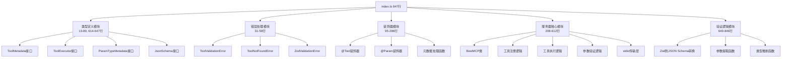
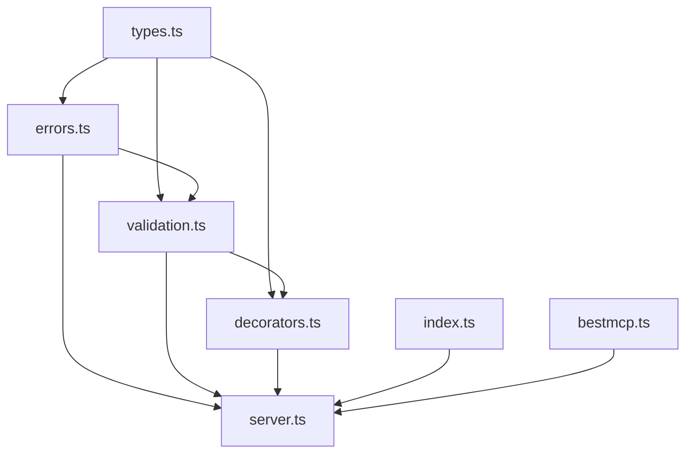
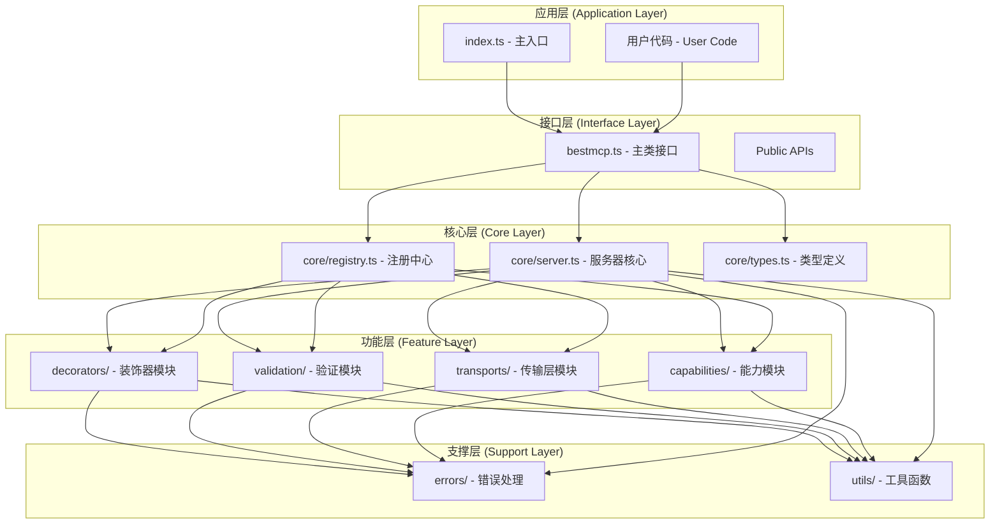
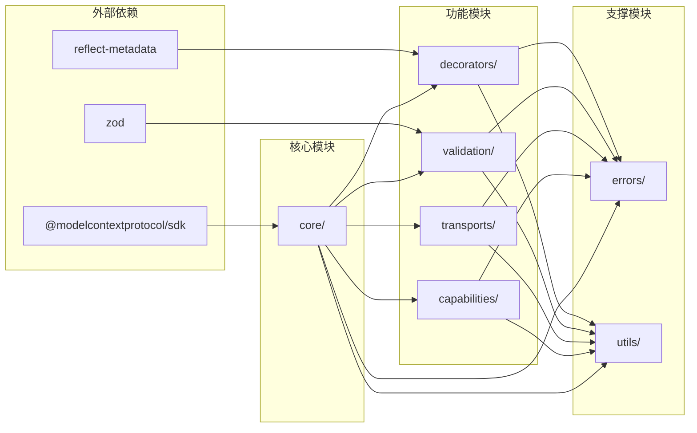
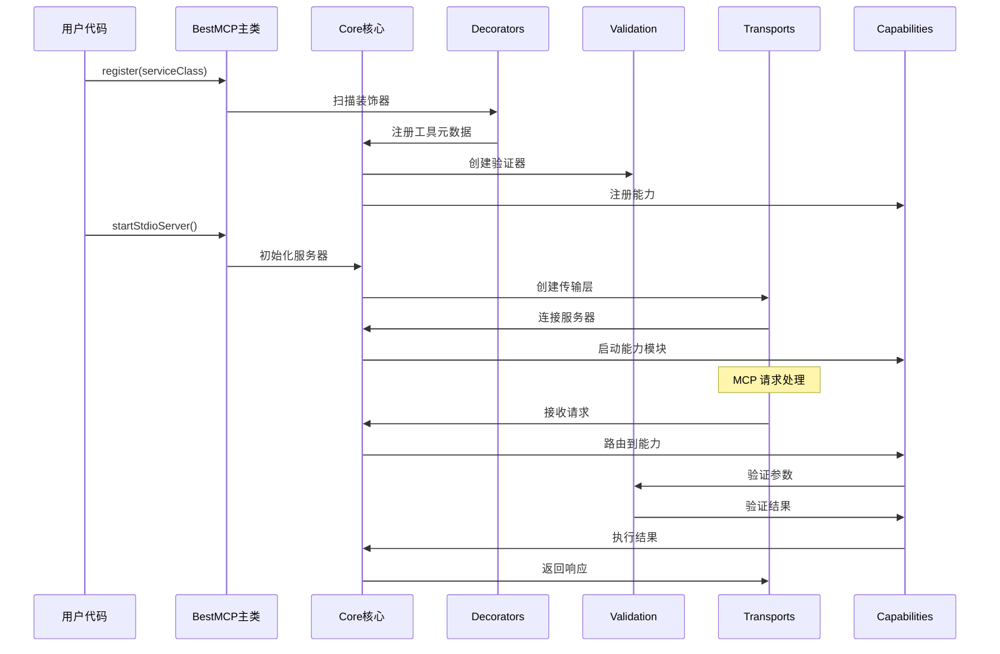
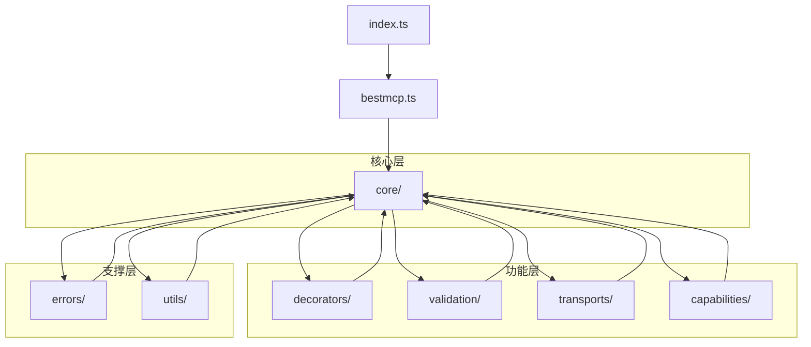
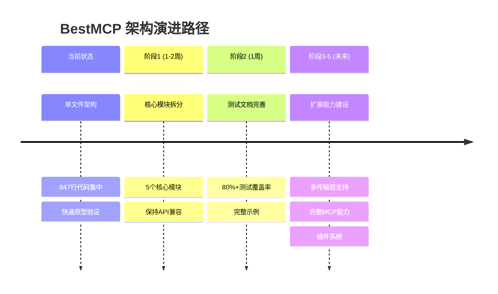

# BestMCP 项目架构演进和目录结构规划分析报告

## 1. 现状分析

### 1.1 项目当前状态

**技术栈**
- **核心框架**: `@modelcontextprotocol/sdk` v1.18.2
- **语言**: TypeScript 5.5.4
- **验证库**: Zod v3.25.76
- **装饰器支持**: reflect-metadata v0.2.2
- **构建工具**: TypeScript Compiler (tsc)

**项目结构**
```
packages/bestmcp/
├── index.ts           # 单一主文件 (847行代码)
├── package.json       # 包配置
├── tsconfig.json      # TS配置
├── README.md          # 详细文档
├── pnpm-lock.yaml     # 依赖锁定
└── dist/              # 构建输出
```

**功能特性**
- ✅ 装饰器驱动的工具定义 (`@Tool`, `@Param`)
- ✅ Zod 参数验证和 JSON Schema 自动生成
- ✅ stdio 传输层支持
- ✅ 类型安全的工具注册和调用
- ✅ 完整的错误处理体系

### 1.2 当前架构优势

1. **简洁性**: 单文件架构便于理解和小型项目快速开发
2. **类型安全**: 完整的 TypeScript 类型支持和编译时检查
3. **开发体验**: 装饰器语法直观，减少样板代码
4. **自动化**: JSON Schema 生成和参数验证自动化
5. **兼容性**: 完全兼容 MCP 协议规范

### 1.3 当前架构局限性

1. **可维护性**: 847行代码集中在单一文件，维护困难
2. **可扩展性**: 新增功能需要修改核心文件，违反开闭原则
3. **测试性**: 缺乏模块化结构，难以编写单元测试
4. **传输层限制**: 仅支持 stdio，无法满足多样化部署需求
5. **功能范围**: 仅支持 Tools，未覆盖 Samples、Prompts、Resources 等 MCP 能力

## 2. 架构挑战分析

### 2.1 多传输层扩展挑战

**当前实现问题**
```typescript
// index.ts:555-574 - 硬编码 stdio 传输层
async startStdioServer() {
  if (!this.server) {
    throw new Error("MCP Server not initialized");
  }
  this.transport = new StdioServerTransport();
  await this.server.connect(this.transport);
}
```

**扩展需求**
- **SSE (Server-Sent Events)**: 支持实时通信和 Web 集成
- **Streamable HTTP**: 支持高并发和负载均衡场景
- **WebSocket**: 支持双向实时通信（未来可能需求）

### 2.2 MCP 协议能力扩展挑战

**缺失功能模块**
- **Samples**: 示例数据管理
- **Prompts**: 提示词模板管理
- **Resources**: 资源访问和管理
- **Logging**: 日志记录和监控

### 2.3 代码组织挑战

**单一文件问题**
- 装饰器逻辑 (95-286行)
- 核心类逻辑 (208-612行)
- 类型转换逻辑 (614-846行)
- 工具函数分散各处

## 3. 新架构设计

### 3.1 总体架构原则

1. **模块化**: 功能按职责分离到独立模块
2. **渐进式**: 基于现状逐步演进，避免过度设计
3. **向后兼容**: 保持现有 API 不变
4. **可测试**: 每个模块独立可测
5. **类型安全**: 保持完整的 TypeScript 类型支持

### 3.1.1 当前阶段拆分方案

#### 代码结构分析

基于对 `packages/bestmcp/index.ts` (847行代码) 的分析，当前文件包含以下功能模块：



#### 第一阶段拆分策略

**目标**: 将单一文件拆分为 5 个核心模块，保持功能完整性和向后兼容性

**拆分优先级**:

1. **高优先级** - 独立性强、依赖简单：
   - `types.ts` - 纯类型定义，无依赖
   - `errors.ts` - 错误类，仅依赖 types
   - `validation.ts` - 验证逻辑，依赖 types 和 errors

2. **中优先级** - 核心业务逻辑：
   - `decorators.ts` - 装饰器，依赖 types、validation
   - `server.ts` - MCP 服务器，依赖所有其他模块

**具体拆分方案**:

```typescript
// src/core/types.ts (从 index.ts:13-89, 614-647 抽取)
export interface ToolMetadata { /* ... */ }
export interface ToolExecutor { /* ... */ }
export interface JsonSchema { /* ... */ }
export interface ParamTypeMetadata { /* ... */ }

// src/core/errors.ts (从 index.ts:31-59 抽取)
export class ToolValidationError extends Error { /* ... */ }
export class ToolNotFoundError extends Error { /* ... */ }
export class ZodValidationError extends Error { /* ... */ }

// src/core/validation.ts (从 index.ts:649-846 抽取)
export function zodSchemaToJsonSchema(zodSchema: z.ZodType): JsonSchema { /* ... */ }
export function inferTypeSchema(type: unknown): JsonSchema { /* ... */ }
export function extractParameters(): { properties: Record<string, JsonSchema>; required: string[] } { /* ... */ }

// src/core/decorators.ts (从 index.ts:95-286 抽取)
export function Tool(description?: string): MethodDecorator { /* ... */ }
export function Param(zodSchema: z.ZodType, description?: string): ParameterDecorator { /* ... */ }

// src/core/server.ts (从 index.ts:208-612 抽取)
export class BestMCP { /* ... */ }
```

**依赖关系图**:



**迁移风险控制**:

1. **API 兼容性保证**:
   - 保持所有公共导出接口不变
   - 通过 index.ts 重新导出所有模块
   - 确保 `import { BestMCP, Tool, Param } from 'bestmcp'` 正常工作

2. **渐进式迁移**:
   - 先创建新模块文件，保留原 index.ts
   - 逐步将原文件内容迁移到新模块
   - 最后更新 index.ts 为聚合导出文件

3. **测试驱动**:
   - 为每个模块创建对应的单元测试
   - 确保拆分后所有现有测试通过
   - 集成测试验证整体功能完整性

**验收标准**:

- [ ] 所有模块拆分完成，职责清晰
- [ ] 现有 API 100% 兼容
- [ ] 所有测试通过
- [ ] 代码覆盖率不低于现有水平
- [ ] 构建产物大小无明显增加

### 3.2 架构层次关系

#### 3.2.1 整体架构层次图



#### 3.2.2 模块依赖关系



#### 3.2.3 数据流向图



### 3.3 渐进式目录结构设计

#### 3.3.1 当前阶段设计（阶段1 - 核心）

基于当前 847 行单一文件的现状，第一阶段采用最简化的拆分策略：

```
packages/bestmcp/
├── src/
│   ├── core/                    # 核心模块（新增）
│   │   ├── types.ts            # 类型定义（从 index.ts:13-89, 614-647 抽取）
│   │   ├── errors.ts           # 错误类（从 index.ts:31-59 抽取）
│   │   ├── decorators.ts       # 装饰器（从 index.ts:95-286 抽取）
│   │   ├── validation.ts       # 验证逻辑（从 index.ts:649-846 抽取）
│   │   └── server.ts           # MCP 服务器（从 index.ts:208-612 抽取）
│   ├── index.ts                # 主入口文件（简化）
│   └── bestmcp.ts              # BestMCP 主类（从 index.ts:208-612 抽取）
├── tests/                      # 测试文件（新增）
│   ├── unit/                   # 单元测试
│   │   ├── core/
│   │   │   ├── types.test.ts
│   │   │   ├── errors.test.ts
│   │   │   ├── decorators.test.ts
│   │   │   ├── validation.test.ts
│   │   │   └── server.test.ts
│   │   └── integration.test.ts
│   └── fixtures/               # 测试数据
│       └── test-services.ts
├── examples/                   # 示例代码（新增）
│   └── basic/
│       ├── math-service.ts
│       └── server.ts
├── index.ts                    # 导出入口（保持兼容）
├── package.json
├── tsconfig.json
├── biome.json                  # Biome 配置（新增）
└── README.md
```

#### 3.3.2 未来扩展设计（阶段2-4）

```
packages/bestmcp/
├── src/
│   ├── core/                    # 核心模块
│   │   ├── server.ts           # MCP 服务器核心
│   │   ├── registry.ts         # 工具注册中心（未来）
│   │   ├── types.ts            # 核心类型定义
│   │   ├── errors.ts           # 错误类
│   │   ├── decorators.ts       # 装饰器
│   │   └── validation.ts       # 验证逻辑
│   ├── transports/             # 传输层模块（阶段2新增）
│   │   ├── base.ts             # 传输层基类
│   │   ├── stdio.ts            # stdio 传输实现
│   │   ├── sse.ts              # SSE 传输实现
│   │   └── http.ts             # HTTP 传输实现
│   ├── capabilities/           # MCP 能力模块（阶段3新增）
│   │   ├── tools/              # Tools 能力
│   │   │   ├── manager.ts      # 工具管理器
│   │   │   ├── executor.ts     # 工具执行器
│   │   │   └── types.ts        # 工具类型
│   │   ├── prompts/            # Prompts 能力
│   │   │   ├── manager.ts
│   │   │   └── types.ts
│   │   ├── resources/          # Resources 能力
│   │   │   ├── manager.ts
│   │   │   └── types.ts
│   │   └── samples/            # Samples 能力
│   │       ├── manager.ts
│   │       └── types.ts
│   ├── plugins/                # 插件系统（阶段4新增）
│   │   ├── manager.ts
│   │   ├── types.ts
│   │   └── registry.ts
│   ├── utils/                  # 工具函数模块（阶段2新增）
│   │   ├── reflect.ts          # 反射工具
│   │   ├── type-inference.ts   # 类型推断
│   │   └── helpers.ts          # 辅助函数
│   ├── index.ts                # 主入口文件
│   └── bestmcp.ts              # BestMCP 主类
├── examples/                   # 示例代码
│   ├── basic/                  # 基础示例
│   ├── advanced/               # 高级示例（阶段2-4）
│   │   ├── multi-transport/
│   │   ├── custom-validation/
│   │   └── plugin-system/
│   └── patterns/               # 设计模式示例（阶段4）
├── tests/                      # 测试文件
│   ├── unit/                   # 单元测试
│   │   ├── core/
│   │   ├── transports/         # 阶段2新增
│   │   ├── capabilities/       # 阶段3新增
│   │   └── plugins/            # 阶段4新增
│   ├── integration/            # 集成测试
│   │   ├── stdio.test.ts
│   │   ├── sse.test.ts         # 阶段2新增
│   │   └── http.test.ts        # 阶段2新增
│   ├── e2e/                    # 端到端测试
│   │   └── scenarios/
│   └── fixtures/               # 测试数据
├── docs/                       # 文档（阶段2新增）
│   ├── api/                    # API 文档
│   ├── guides/                 # 使用指南
│   └── patterns/               # 设计模式文档
├── index.ts                    # 导出入口
├── package.json
├── tsconfig.json
├── tsconfig.build.json         # 构建配置（阶段2新增）
├── biome.json                  # Biome 配置
└── README.md
```

### 3.4 核心模块设计

#### 3.4.1 Core 模块架构

Core 模块是整个 BestMCP 框架的核心中枢，负责协调各个功能模块并提供统一的接口层。

**Core 目录的职责和作用：**

1. **服务器生命周期管理**：负责 MCP 服务器的创建、配置、启动和停止
2. **组件注册中心**：统一管理工具、装饰器、传输层和能力模块的注册
3. **模块协调器**：协调 decorators、validation、transports、capabilities 等模块间的交互
4. **配置管理中心**：处理服务器配置、传输层配置和能力配置
5. **事件系统核心**：提供框架级别的事件发布订阅机制

**为什么需要单独拆分 core 目录：**

1. **单一职责原则**：将核心协调逻辑与具体功能实现分离
2. **依赖管理清晰**：core 作为基础设施层，其他模块依赖 core，但模块间相互独立
3. **可测试性提升**：核心逻辑可以独立测试，不依赖具体功能实现
4. **扩展性保证**：新增功能模块时，只需在 core 中注册，不影响现有模块

**Core 目录与其他模块的关系：**



**Core 目录在架构中的层级：**

Core 目录处于架构的中心位置，既是基础支撑层，又是协调中枢：

- **对下**：依赖 utils 和 errors 提供的基础能力
- **对上**：为 bestmcp.ts 主类提供核心服务
- **横向**：协调 decorators、validation、transports、capabilities 等功能模块

#### 3.4.2 传输层抽象

```typescript
// src/transports/base.ts
export abstract class BaseTransport {
  abstract connect(server: Server): Promise<void>;
  abstract disconnect(): Promise<void>;
  abstract isConnected(): boolean;
  abstract getType(): TransportType;
}

export enum TransportType {
  STDIO = 'stdio',
  SSE = 'sse',
  HTTP = 'http'
}
```

#### 3.4.3 能力系统设计

```typescript
// src/core/capability-manager.ts
export class CapabilityManager {
  private capabilities = new Map<CapabilityType, BaseCapability>();

  register<T extends BaseCapability>(capability: T): void {
    this.capabilities.set(capability.getType(), capability);
  }

  get<T extends BaseCapability>(type: CapabilityType): T | undefined {
    return this.capabilities.get(type) as T;
  }
}
```

#### 3.4.4 插件系统架构

```typescript
// src/core/plugin.ts
export interface Plugin {
  name: string;
  version: string;
  install(server: BestMCP): void | Promise<void>;
  uninstall?(server: BestMCP): void | Promise<void>;
}

export class PluginManager {
  private plugins = new Map<string, Plugin>();

  async install(plugin: Plugin): Promise<void> {
    await plugin.install(this.server);
    this.plugins.set(plugin.name, plugin);
  }
}
```

## 4. 实施方案

### 4.1 渐进式重构计划

#### 阶段 1: 核心模块拆分 (1-2周)
**目标**: 将 847 行单一文件拆分为 5 个核心模块，保持向后兼容

**任务清单**:
- [ ] 创建 `src/core/` 目录结构
- [ ] 抽取类型定义到 `types.ts` (13-89, 614-647行)
- [ ] 抽取错误类到 `errors.ts` (31-59行)
- [ ] 抽取验证逻辑到 `validation.ts` (649-846行)
- [ ] 抽取装饰器到 `decorators.ts` (95-286行)
- [ ] 抽取服务器核心到 `server.ts` (208-612行)
- [ ] 更新 `index.ts` 为聚合导出文件
- [ ] 保持所有现有 API 接口不变

**验收标准**:
- [ ] 模块拆分完成，职责清晰
- [ ] 现有 API 100% 兼容
- [ ] 所有现有测试通过
- [ ] 构建产物大小无明显增加

#### 阶段 2: 测试和文档完善 (1周)
**目标**: 建立完整的测试体系和基础文档

**任务清单**:
- [ ] 为每个核心模块创建单元测试
- [ ] 创建集成测试验证模块协作
- [ ] 添加基础示例代码
- [ ] 更新 README 文档
- [ ] 配置 Biome 代码规范工具

**验收标准**:
- [ ] 代码覆盖率 > 80%
- [ ] 所有测试通过
- [ ] 示例代码可正常运行
- [ ] 文档完整准确

#### 阶段 3: 传输层扩展 (2-3周) - 未来
**目标**: 实现多传输层支持

**任务清单**:
- [ ] 实现传输层基类抽象
- [ ] 实现 SSE 传输层
- [ ] 实现 HTTP 传输层
- [ ] 添加传输层配置系统
- [ ] 编写传输层测试

**验收标准**:
- stdio/SSE/HTTP 三种传输层正常工作
- 传输层可以动态切换
- 配置系统完整可用
- 所有传输层测试通过

#### 阶段 4: MCP 能力扩展 (3-4周) - 未来
**目标**: 扩展 Samples、Prompts、Resources 支持

**任务清单**:
- [ ] 设计通用能力接口
- [ ] 实现 Prompts 管理系统
- [ ] 实现 Resources 管理系统
- [ ] 实现 Samples 管理系统
- [ ] 添加能力装饰器支持
- [ ] 编写能力模块测试

**验收标准**:
- 三种新能力完整实现
- 装饰器语法支持新能力
- 能力可以独立注册和使用
- 文档和示例完整

#### 阶段 5: 高级特性 (2-3周) - 未来
**目标**: 实现插件系统和高级功能

**任务清单**:
- [ ] 实现插件管理系统
- [ ] 添加中间件支持
- [ ] 实现配置系统
- [ ] 添加监控和日志系统
- [ ] 性能优化和基准测试

**验收标准**:
- 插件系统可以动态加载
- 中间件机制正常工作
- 配置系统灵活易用
- 性能满足要求

### 4.2 当前态与最终态对比分析

#### 4.2.1 当前状态（单文件架构）

**优势**:
- ✅ **简洁性**: 847 行代码集中在一个文件中，便于理解整体逻辑
- ✅ **开发效率**: 无需考虑模块间依赖，开发速度快
- ✅ **部署简单**: 单文件分发，无复杂的构建配置

**局限性**:
- ❌ **可维护性差**: 847 行代码混合多种职责，修改风险高
- ❌ **可测试性弱**: 难以编写单元测试，测试覆盖率低
- ❌ **可扩展性限制**: 新增功能需要修改核心文件
- ❌ **协作困难**: 多人开发时容易冲突

**适用场景**:
- 概念验证和原型开发
- 小型项目和个人工具
- 快速迭代和功能验证

#### 4.2.2 最终状态（模块化架构）

**优势**:
- ✅ **职责清晰**: 每个模块负责特定功能，代码组织良好
- ✅ **易于测试**: 模块独立，便于编写单元测试和集成测试
- ✅ **可扩展性强**: 支持插件式扩展，满足多样化需求
- ✅ **团队协作**: 模块边界清晰，减少开发冲突
- ✅ **维护性高**: 修改影响范围可控，风险较低

**复杂性**:
- ⚠️ **学习成本**: 需要理解模块间关系和依赖
- ⚠️ **构建配置**: 需要配置模块打包和依赖管理
- ⚠️ **开发复杂度**: 需要遵循模块开发规范

**适用场景**:
- 企业级项目和长期维护
- 团队协作开发
- 复杂业务逻辑和多样化需求

#### 4.2.3 渐进式演进路径



#### 4.2.4 关键决策点

**立即执行（阶段1-2）**:
- 解决当前可维护性问题
- 建立测试基础设施
- 为未来扩展奠定基础

**延期执行（阶段3-5）**:
- 基于实际需求决定优先级
- 避免过度设计
- 保持架构演进的可逆性

### 4.3 向后兼容性保证

#### 4.3.1 API 兼容性
```typescript
// 保持原有构造函数签名
export class BestMCP {
  constructor(name: string, version: string = "1.0.0");

  // 保持原有方法签名
  register<T>(serviceClass: new () => T): void;
  async run(): Promise<void>;
  async startStdioServer(): Promise<void>;
}

// 新增配置式启动方式
export interface BestMCPConfig {
  name: string;
  version?: string;
  transports: TransportConfig[];
  capabilities?: CapabilityConfig[];
  plugins?: PluginConfig[];
}

export class BestMCP {
  static async create(config: BestMCPConfig): Promise<BestMCP>;
}
```

#### 4.3.2 装饰器兼容性
```typescript
// 原有装饰器保持不变
@Tool(description?: string): MethodDecorator
@Param(zodSchema: ZodSchema, description?: string): ParameterDecorator

// 新增能力装饰器
@Prompt(description?: string): MethodDecorator
@Resource(description?: string): MethodDecorator
@Sample(description?: string): MethodDecorator
```

### 4.4 测试策略

#### 4.4.1 测试覆盖率目标
- **单元测试**: 90%+ 代码覆盖率
- **集成测试**: 100% API 覆盖率
- **端到端测试**: 核心场景全覆盖

#### 4.4.2 测试结构
```
tests/
├── unit/                    # 单元测试 (快速反馈)
├── integration/             # 集成测试 (模块协作)
├── e2e/                     # 端到端测试 (完整场景)
└── fixtures/                # 测试数据和 Mock
```

## 5. 技术选型和最佳实践

### 5.1 依赖管理策略

#### 5.1.1 核心依赖
```json
{
  "dependencies": {
    "@modelcontextprotocol/sdk": "^1.18.2",
    "zod": "^3.25.76",
    "reflect-metadata": "^0.2.2",
    "eventemitter3": "^5.0.1"        // 事件系统
  }
}
```

#### 5.1.2 可选依赖
```json
{
  "optionalDependencies": {
    "fastify": "^4.24.3",            // HTTP 服务器
    "ws": "^8.14.2"                  // WebSocket 支持
  },
  "peerDependencies": {
    "fastify": ">=4.0.0",
    "ws": ">=8.0.0"
  }
}
```

### 5.2 TypeScript 配置优化

#### 5.2.1 项目引用 (Project References)
```json
// tsconfig.json
{
  "compilerOptions": {
    "composite": true,
    "declaration": true,
    "declarationMap": true
  },
  "references": [
    { "path": "./src/core" },
    { "path": "./src/transports" },
    { "path": "./src/capabilities" }
  ]
}
```

#### 5.2.2 严格类型检查
```json
{
  "compilerOptions": {
    "strict": true,
    "noImplicitAny": true,
    "noImplicitReturns": true,
    "noUncheckedIndexedAccess": true,
    "exactOptionalPropertyTypes": true
  }
}
```

### 5.3 代码质量和构建策略

#### 5.3.1 Biome 代码规范配置

Biome 作为现代化的代码检查和格式化工具，替代了传统的 ESLint + Prettier 组合：

```json
// biome.json
{
  "$schema": "https://biomejs.dev/schemas/1.4.1/schema.json",
  "organizeImports": {
    "enabled": true
  },
  "linter": {
    "enabled": true,
    "rules": {
      "recommended": true,
      "complexity": {
        "noExcessiveCognitiveComplexity": "warn"
      },
      "correctness": {
        "noUnusedVariables": "error",
        "useExhaustiveDependencies": "warn"
      },
      "style": {
        "noNegationElse": "error",
        "useConsistentArrayType": "error"
      },
      "suspicious": {
        "noExplicitAny": "error",
        "noArrayIndexKey": "warn"
      }
    }
  },
  "formatter": {
    "enabled": true,
    "formatWithErrors": false,
    "indentStyle": "space",
    "indentWidth": 2,
    "lineWidth": 100
  },
  "javascript": {
    "formatter": {
      "quoteStyle": "single",
      "semicolons": "always",
      "trailingComma": "es5"
    }
  },
  "typescript": {
    "formatter": {
      "quoteStyle": "single",
      "semicolons": "always",
      "trailingComma": "es5"
    }
  }
}
```

#### 5.3.2 构建和发布策略

##### 5.3.2.1 多输出格式
```json
{
  "exports": {
    ".": {
      "import": "./dist/esm/index.js",
      "require": "./dist/cjs/index.js",
      "types": "./dist/types/index.d.ts"
    },
    "./transports": {
      "import": "./dist/esm/transports/index.js",
      "require": "./dist/cjs/transports/index.js"
    }
  }
}
```

##### 5.3.2.2 渐进式发布
- **主版本**: 破坏性变更
- **次版本**: 新功能添加
- **补丁版本**: Bug 修复

## 6. 风险评估和缓解策略

### 6.1 技术风险

#### 6.1.1 复杂性增加风险
**风险**: 新架构可能增加学习成本和维护复杂度
**缓解策略**:
- 提供详细的迁移指南
- 保持向后兼容的 API
- 提供多种使用模式的示例

#### 6.1.2 性能风险
**风险**: 模块化可能带来性能开销
**缓解策略**:
- 树摇优化减少包体积
- 懒加载非核心模块
- 性能基准测试监控

#### 6.1.3 兼容性风险
**风险**: MCP SDK 变更可能影响兼容性
**缓解策略**:
- 锁定核心依赖版本
- 实现适配器模式隔离变更
- 定期更新和测试

### 6.2 项目风险

#### 6.2.1 开发周期风险
**风险**: 重构周期可能超出预期
**缓解策略**:
- 分阶段实施，降低单次变更风险
- 保持现有功能同步开发
- 预留缓冲时间

#### 6.2.2 回归风险
**风险**: 重构可能引入新 Bug
**缓解策略**:
- 完整的测试覆盖
- 灰度发布策略
- 快速回滚机制

## 7. 结论和建议

### 7.1 架构演进必要性

**当前状态评估**: BestMCP 作为单文件架构的原型项目，在概念验证阶段表现出色，但随着功能需求增长，现有架构已面临可维护性、可扩展性和测试性的挑战。

**演进必要性**:
- ✅ **功能扩展需求**: 多传输层和完整 MCP 能力支持
- ✅ **工程化需求**: 测试、文档、示例的完整性
- ✅ **生态建设需求**: 插件系统和扩展机制
- ✅ **长期维护需求**: 模块化架构便于持续迭代

### 7.2 实施建议

#### 7.2.1 优先级排序
1. **立即执行**: 核心模块拆分和测试完善（阶段1-2，2-3周）
2. **按需执行**: 传输层扩展（阶段3，2-3周）
3. **长期规划**: MCP 能力扩展和插件系统（阶段4-5，5-7周）

#### 7.2.2 资源分配建议
- **核心重构**: 2-3周（立即投入）
- **测试文档**: 1周（质量保证）
- **扩展功能**: 按需分配（基于实际需求）
- **总计**: 3-4周可完成基础重构，后续按需扩展

#### 7.2.3 质量保证建议
- 建立完整的 CI/CD 流程
- 实现代码覆盖率监控
- 建立性能基准测试
- 定期进行架构评审

### 7.3 长期愿景

通过本次架构演进，BestMCP 将成为：

1. **企业级 MCP 框架**: 支持大规模生产环境部署
2. **生态友好框架**: 丰富的插件和扩展机制
3. **开发者友好**: 优秀的开发体验和文档
4. **高性能**: 支持高并发和低延迟场景
5. **标准兼容**: 完全兼容 MCP 协议规范

### 7.4 成功指标

#### 7.4.1 技术指标
- [ ] 代码覆盖率 > 90%
- [ ] 构建时间 < 30s
- [ ] 包体积增长 < 50%
- [ ] 性能不低于现有实现

#### 7.4.2 生态指标
- [ ] 社区贡献增长
- [ ] 插件生态建立
- [ ] 企业用户采用
- [ ] 文档完整性评分 > 4.5/5

#### 7.4.3 开发体验指标
- [ ] 新用户上手时间 < 30分钟
- [ ] API 学习曲线平缓
- [ ] 错误信息清晰易懂
- [ ] 调试工具完善

通过系统性的架构演进，BestMCP 将从当前的原型级框架成长为生产就绪的企业级 MCP 服务器框架，为 TypeScript/Node.js 生态系统提供最佳的 MCP 开发体验。
