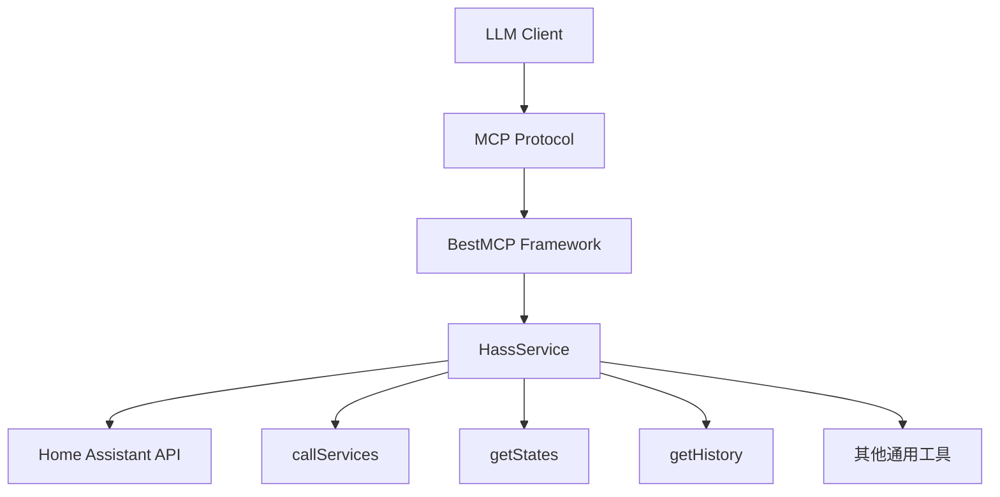
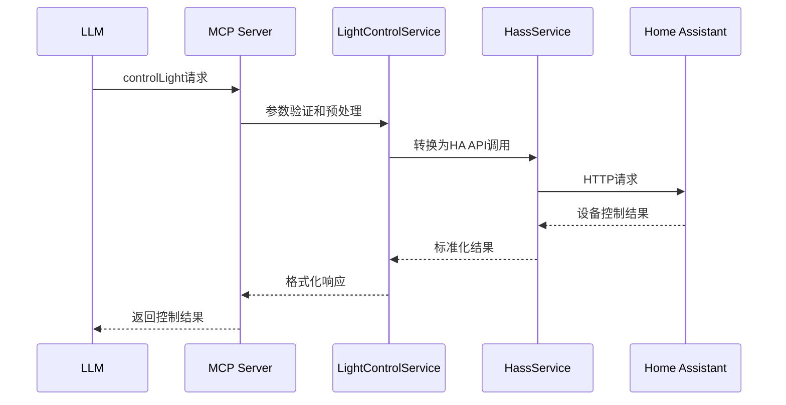

# Home-MCP 灯光控制工具技术方案

## 1. 现状分析

### 1.1 项目背景

Home-MCP 是一个基于 Model Context Protocol (MCP) 的智能家居集成服务器，目前通过 Home Assistant REST API 提供基础的设备控制功能。项目已实现 15 个通用工具，但缺乏针对灯光控制的专用语义化工具。

### 1.2 当前灯光控制能力分析

通过分析现有代码，当前项目中灯光控制相关的功能：

#### 现有工具支持
- **通用设备控制**: 通过 `callServices` 工具可以调用 Home Assistant 的 `light` 域服务
- **状态查询**: 通过 `getStates` 工具可以查询灯光设备状态
- **历史数据**: 通过 `getHistory` 工具可以查询灯光状态变化历史

#### 现有实现的局限性
1. **技术化接口**: 直接暴露 Home Assistant API，缺乏语义化封装
2. **参数复杂**: 用户需要了解 Home Assistant 的服务调用格式
3. **功能分散**: 灯光控制功能分散在多个通用工具中
4. **LLM理解困难**: 工具描述不够直观，LLM难以准确选择和使用

### 1.3 灯光控制需求分析

基于智能家居使用场景，灯光控制需求包括：

#### 基础控制需求
- **开关控制**: 打开、关闭、切换灯光状态
- **亮度调节**: 设置亮度百分比、亮度增减
- **颜色控制**: RGB 颜色设置、HSL 颜色调节
- **色温控制**: 冷暖色温调节

#### 高级控制需求
- **场景模式**: 阅读模式、放松模式、工作模式、派对模式、睡眠模式
- **渐变效果**: 开关渐变、亮度渐变、颜色渐变
- **分组控制**: 房间级灯光控制、区域级灯光控制

## 2. 当前架构分析

### 2.1 技术架构概览



### 2.2 现有工具实现分析

#### 核心服务类结构
```typescript
class HassService {
  // 当前通过 callServices 实现灯光控制
  @Tool("在指定域内调用一个服务")
  async callServices(payload: {
    domain: string;        // "light"
    service: string;       // "turn_on", "turn_off", "toggle", etc.
    service_data?: object; // { entity_id: "light.xxx", brightness: 255, etc. }
  })

  // 通过 getStates 查询灯光状态
  @Tool("获取 Home Assistant 中所有实体的状态信息")
  async getStates(payload?: { entity_id?: string })
}
```

#### 技术栈分析
- **MCP 框架**: `@modelcontextprotocol/sdk` + `bestmcp`
- **参数验证**: Zod schema 验证
- **API 通信**: Home Assistant REST API
- **类型安全**: TypeScript 完整类型定义

### 2.3 架构优势与不足

#### 优势
- **完整功能覆盖**: 通过通用工具可以访问所有 Home Assistant 功能
- **类型安全**: 完整的 TypeScript 类型定义
- **稳定可靠**: 基于成熟的 Home Assistant API

#### 不足
- **缺乏语义化**: 工具名称和描述过于技术化
- **使用复杂**: 需要了解 Home Assistant 的服务调用方式
- **LLM友好度低**: 工具描述不够直观，LLM难以准确理解

## 3. 技术方案

### 3.1 设计原则

#### LLM导向设计
- **意图完整**: 单一工具覆盖完整的"灯光控制"意图域
- **语义清晰**: 工具名称和描述便于LLM理解
- **参数完整**: 支持完整的灯光控制参数表达
- **使用直观**: LLM能够根据用户自然语言直接映射到工具调用

#### 功能完整性
- **基础控制**: 开关、亮度、颜色、色温
- **高级功能**: 场景模式、渐变效果
- **批量操作**: 支持多设备同时控制
- **状态查询**: 集成状态查询功能

### 3.2 核心工具设计

#### 3.2.1 主控制工具 - controlLight

```typescript
@Tool("控制灯光设备 - 支持开关、亮度、颜色、色温调节和场景模式")
async controlLight(
  @Param(z.object({
    // 基础参数
    entity_id: z.string().describe("灯光设备的实体ID，如 'light.living_room' 或多个设备用逗号分隔"),
    action: z.enum([
      'turn_on', 'turn_off', 'toggle',           // 开关控制
      'brightness', 'color', 'temperature',     // 参数调节
      'scene'                                    // 场景模式
    ]).describe("要执行的灯光控制操作类型"),

    // 亮度控制参数
    brightness: z.number().min(1).max(100).optional()
      .describe("亮度百分比 (1-100)，当action为brightness时需要"),
    brightness_step: z.number().optional()
      .describe("亮度增减步长 (-100到100)，正值增加亮度，负值减少亮度"),

    // 颜色控制参数
    color: z.object({
      r: z.number().min(0).max(255).describe("红色分量 (0-255)"),
      g: z.number().min(0).max(255).describe("绿色分量 (0-255)"),
      b: z.number().min(0).max(255).describe("蓝色分量 (0-255)")
    }).optional().describe("RGB颜色值，当action为color时需要"),

    // 色温控制参数
    temperature: z.number().min(2700).max(6500).optional()
      .describe("色温值(2700K-6500K)，当action为temperature时需要"),
    temperature_step: z.number().optional()
      .describe("色温增减步长，正值增加色温(更冷)，负值降低色温(更暖)"),

    // 场景模式参数
    scene: z.enum([
      'reading', 'relaxing', 'working', 'party',
      'sleeping', 'movie', 'dinner', 'romantic'
    ]).optional().describe("预设场景模式，当action为scene时需要"),

    // 渐变效果参数
    transition: z.number().min(0.1).max(60).optional()
      .describe("渐变时间(秒)，支持0.1-60秒的平滑过渡效果"),

    // 扩展参数
    flash: z.enum(['short', 'long']).optional()
      .describe("闪烁效果，short为短闪，long为长闪"),
    effect: z.string().optional()
      .describe("特殊效果名称，如支持的自定义效果")
  }))
  params: LightControlParams
): Promise<LightControlResult>
```

#### 3.2.2 状态查询工具 - getLightStatus

```typescript
@Tool("查询灯光设备状态 - 获取单个或多个灯光设备的详细状态信息")
async getLightStatus(
  @Param(z.object({
    entity_id: z.string().optional()
      .describe("灯光设备实体ID，不填则查询所有灯光设备"),
    room: z.string().optional()
      .describe("房间名称筛选，支持模糊匹配如'客厅'、'卧室'"),
    include_attributes: z.boolean().optional().default(true)
      .describe("是否包含详细属性信息如颜色、色温、亮度等"),
    group_by: z.enum(['room', 'type', 'none']).optional().default('none')
      .describe("分组方式：room按房间分组，type按设备类型分组，none不分组")
  }))
  params: LightStatusQueryParams
): Promise<LightStatusResult>
```


### 3.3 技术实现架构

#### 3.3.1 服务类设计

```typescript
class LightControlService {
  private hassService: HassService;

  constructor(hassService: HassService) {
    this.hassService = hassService;
  }

  // 主控制工具实现
  async controlLight(params: LightControlParams): Promise<LightControlResult> {
    // 参数验证和预处理
    // 调用 Home Assistant API
    // 结果处理和返回
  }

  // 状态查询工具实现
  async getLightStatus(params: LightStatusQueryParams): Promise<LightStatusResult> {
    // 设备筛选和状态查询
    // 结果格式化和分组
  }
}
```

#### 3.3.2 数据流架构



### 3.4 类型定义设计

```typescript
// 灯光控制参数类型
interface LightControlParams {
  entity_id: string;
  action: 'turn_on' | 'turn_off' | 'toggle' | 'brightness' | 'color' | 'temperature' | 'scene';
  brightness?: number;
  brightness_step?: number;
  color?: { r: number; g: number; b: number };
  temperature?: number;
  temperature_step?: number;
  scene?: 'reading' | 'relaxing' | 'working' | 'party' | 'sleeping' | 'movie' | 'dinner' | 'romantic';
  transition?: number;
  flash?: 'short' | 'long';
  effect?: string;
}

// 灯光状态查询参数类型
interface LightStatusQueryParams {
  entity_id?: string;
  room?: string;
  include_attributes?: boolean;
  group_by?: 'room' | 'type' | 'none';
}


// 结果类型定义
interface LightControlResult {
  success: boolean;
  affected_entities: string[];
  updated_states: HassState[];
  errors?: string[];
  execution_time: number;
}

interface LightStatusResult {
  lights: Array<{
    entity_id: string;
    friendly_name?: string;
    state: 'on' | 'off';
    brightness?: number;
    color?: { r: number; g: number; b: number };
    temperature?: number;
    last_updated: string;
  }>;
  groups?: Record<string, Array<any>>;
  total_count: number;
}

```

## 4. 实施方案

### 4.1 分阶段实施策略

基于项目现状和技术复杂度，采用三阶段渐进式实施策略，专注于核心灯光控制功能：

#### 阶段一：基础控制功能实现（1-2周）

**目标**: 实现核心灯光控制功能，确保基础控制能力

**具体任务**:
1. **类型定义创建**
   - 创建 `src/types/light.ts` 文件
   - 定义所有灯光控制相关的TypeScript接口
   - 建立完整的类型安全体系

2. **服务类实现**
   - 创建 `src/services/light-control.ts` 文件
   - 实现 `LightControlService` 类
   - 实现核心 `controlLight` 工具方法

3. **API集成**
   - 集成现有 `HassService` 的 `callServices` 方法
   - 实现参数转换和结果处理逻辑
   - 建立错误处理机制

4. **基础测试**
   - 编写单元测试覆盖核心功能
   - 验证与 Home Assistant API 的集成
   - 确保类型安全和参数验证

**验收标准**:
- [ ] 支持 turn_on、turn_off、toggle 基础操作
- [ ] 支持亮度调节功能
- [ ] 支持RGB颜色设置
- [ ] 支持色温调节
- [ ] 所有单元测试通过
- [ ] 集成测试验证成功

#### 阶段二：高级功能和查询能力（2-3周）

**目标**: 实现状态查询、场景模式和高级控制功能

**具体任务**:
1. **状态查询功能**
   - 实现 `getLightStatus` 工具方法
   - 支持设备筛选和分组功能
   - 实现状态数据格式化和优化

2. **场景模式支持**
   - 实现预设场景模式（阅读、放松、工作等）
   - 支持渐变效果和时间控制
   - 建立场景配置体系

3. **高级控制功能**
   - 支持批量设备控制
   - 实现闪烁效果和特殊效果
   - 添加亮度/色温步进调节

4. **错误处理优化**
   - 完善错误处理和重试机制
   - 添加详细的错误信息和建议
   - 实现操作日志记录

**验收标准**:
- [ ] 支持多设备状态查询和分组
- [ ] 实现8种预设场景模式
- [ ] 支持渐变和闪烁效果
- [ ] 批量控制功能正常
- [ ] 错误处理机制完善
- [ ] 性能测试通过

#### 阶段三：性能优化和文档完善（1-2周）

**目标**: 完成性能优化和文档体系建设

**具体任务**:
1. **性能优化**
   - 优化API调用频率和批量处理
   - 实现结果缓存机制
   - 添加响应时间监控

2. **错误处理增强**
   - 完善错误处理和重试机制
   - 添加详细的错误信息和建议
   - 实现操作日志记录

3. **文档和示例**
   - 编写完整的API文档
   - 创建使用示例和最佳实践
   - 更新项目文档

4. **集成测试**
   - 端到端功能测试
   - LLM集成测试
   - 用户场景验证

**验收标准**:
- [ ] 性能指标达到要求（响应时间 < 2秒）
- [ ] 错误处理机制完善
- [ ] 文档完整准确
- [ ] 所有测试通过
- [ ] LLM使用验证成功

### 4.2 详细实施计划

#### 4.2.1 技术实施细节

**文件结构规划**:
```
src/
├── types/
│   ├── light.ts              # 灯光控制相关类型定义
│   └── index.ts              # 类型导出
├── services/
│   ├── light-control.ts      # 灯光控制服务类
│   └── index.ts              # 服务导出
├── utils/
│   ├── light-utils.ts        # 灯光控制工具函数
│   └── index.ts              # 工具函数导出
└── index.ts                  # 主入口文件
```

**关键实现要点**:
1. **向后兼容**: 保持现有 `HassService` 不变，新增 `LightControlService`
2. **渐进式**: 通过工具描述引导LLM优先使用新工具
3. **类型安全**: 所有新功能都有完整的TypeScript类型定义
4. **错误处理**: 完善的错误处理和用户友好的错误信息

#### 4.2.2 风险评估和缓解策略

**技术风险**:
1. **Home Assistant API变更**
   - 风险等级: 中
   - 缓解策略: 使用稳定的REST API，建立API版本兼容性检查

2. **性能瓶颈**
   - 风险等级: 低
   - 缓解策略: 实现批量操作和缓存机制

3. **LLM工具选择困难**
   - 风险等级: 中
   - 缓解策略: 优化工具描述，添加使用引导

**实施风险**:
1. **开发时间超期**
   - 风险等级: 低
   - 缓解策略: 分阶段实施，每阶段独立可交付

2. **测试覆盖不足**
   - 风险等级: 低
   - 缓解策略: 严格的测试要求和代码审查

### 4.3 质量保证策略

#### 4.3.1 测试策略

**单元测试**:
- 覆盖所有工具方法的参数验证
- 测试各种参数组合和边界条件
- 验证错误处理逻辑

**集成测试**:
- 与Home Assistant API的集成测试
- 端到端功能验证
- 性能和稳定性测试

**LLM兼容性测试**:
- 验证工具描述的清晰度
- 测试LLM工具选择的准确性
- 验证参数理解和使用

#### 4.3.2 代码质量标准

**TypeScript严格模式**:
- 启用所有严格类型检查
- 禁止使用`any`类型
- 完整的类型覆盖率

**代码规范**:
- 遵循项目的ESLint和Prettier配置
- 完整的JSDoc注释
- 清晰的变量和方法命名

**性能标准**:
- API响应时间 < 2秒
- 内存使用稳定
- 错误率 < 1%

### 4.4 部署和监控

#### 4.4.1 部署策略

**灰度发布**:
- 首先在测试环境验证所有功能
- 逐步在生产环境启用新工具
- 监控使用情况和错误率

**回滚机制**:
- 保持旧工具的可用性
- 快速回滚机制
- 数据备份和恢复

#### 4.4.2 监控指标

**功能指标**:
- 工具调用成功率
- 平均响应时间
- 错误类型分布

**使用指标**:
- 工具使用频率
- 参数分布统计
- 用户场景分析

**技术指标**:
- API调用次数
- 内存使用情况
- CPU使用率

## 5. 评估过程说明

### 5.1 技术可行性评估

#### 5.1.1 现有技术栈兼容性
- **MCP框架**: `bestmcp` 完全支持新工具添加
- **类型系统**: TypeScript 可以完美支持复杂的灯光控制类型
- **API集成**: 现有 Home Assistant API 完全支持灯光控制功能
- **测试框架**: Vitest 可以覆盖所有测试需求

#### 5.1.2 开发复杂度评估
- **低复杂度**: 基础开关和亮度控制（基于现有API）
- **中等复杂度**: 颜色和色温控制（需要参数转换）
- **中等复杂度**: 批量操作和状态查询（需要数据处理）

### 5.2 性能影响评估

#### 5.2.1 API调用优化
- **批量操作**: 减少多次API调用
- **结果缓存**: 避免重复的状态查询
- **异步处理**: 提高响应速度

#### 5.2.2 内存使用评估
- **类型定义**: 增加约200KB类型定义文件
- **服务类**: 增加约50KB服务类代码
- **总影响**: 预计增加内存使用 < 1MB

### 5.3 LLM使用体验评估

#### 5.3.1 工具发现性
- **语义化命名**: 工具名称直观易懂
- **完整描述**: 详细的功能说明和使用示例
- **参数友好**: 参数名称和描述符合LLM理解模式

#### 5.3.2 使用便捷性
- **单一工具**: 一个工具覆盖完整控制需求
- **参数灵活**: 支持多种控制模式和参数组合
- **错误友好**: 清晰的错误信息和解决建议

### 5.4 维护成本评估

#### 5.4.1 代码维护
- **模块化设计**: 职责清晰，便于维护
- **类型安全**: 减少运行时错误
- **测试覆盖**: 保证代码质量

#### 5.4.2 文档维护
- **自动生成**: 类型定义自动生成文档
- **示例完整**: 提供丰富的使用示例
- **版本管理**: 清晰的版本变更记录

## 6. 结论

本技术方案基于现有 Home-MCP 项目架构，设计了一套专注的灯光控制MCP工具体系。方案采用LLM导向的设计理念，通过两个核心工具（controlLight 和 getLightStatus）提供完整的灯光控制能力：

1. **controlLight()** - 主控制工具，支持开关、亮度、颜色、色温调节和预设场景模式
2. **getLightStatus()** - 状态查询工具，支持设备筛选、分组和详细信息查询

方案采用三阶段渐进式实施策略，专注于核心灯光控制功能，避免过度复杂的场景管理系统，确保技术风险可控，每个阶段都有明确的交付目标和验收标准。通过完整的技术架构设计和质量保证策略，确保实施过程的技术可靠性和最终产品的使用体验。

该方案的实施将显著提升Home-MCP项目在灯光控制方面的LLM友好度，为用户提供更自然、更智能的智能家居控制体验。